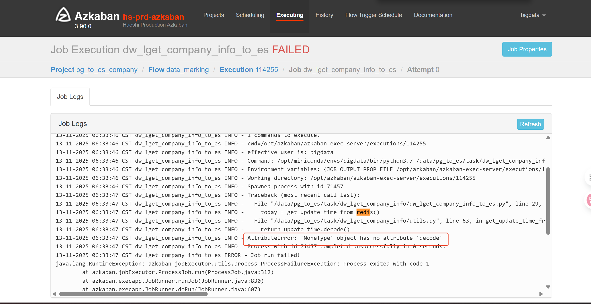

#### 11.10 - 11.14

***泰州项目***

项目问题

1.入园企业，最新数据时间为：2025年2月28日，需数据中心进一步排查新仓-老仓的数据更新；
2.专利：最新数据未2025年7月25日，需数据中心确认数据源数据更新情况；
3.发表论文：最新数据未2025年3月，需数据中心确认数据源数据更新情况；

azkaban：以下两个代码应该是实现打标功能

载体代码：http://192.168.201.25:8081/manager?project=zwq_new_project_zaiti 曲明强

relation代码：http://192.168.201.25:8081/manager?project=hsdata_task_center_relation

代码问题

1.在排查后发现，载体代码中有一条脏数据录入到es库中，程序在读取es数据转换时报错，解决方法是将es的脏数据手动修改正确，然后重新同步；

2.relation代码中是在访问reids函数时获取时间异常，解决方法是修改utils.py的代码逻辑；

3.并且在排查时发现以上两个azkaban项目有索引报错的情况，已经反馈运维对ES集群机型修复；

4.园区的数据是根据业务提供的逻辑补充进23库的govern.dw_lget_es_company表中，

***武汉项目***

项目问题：武汉项目以下表未正常更新，请排查是否正常运行。之前此表流程代码方伟负责过。

tzcmc.ods_map_significant_events_warning， --
public.ods_reg_chart_field_trigger

azkaban:

tzcmc.ods_map_significant_events_warning表代码：http://192.168.201.25:8081/manager?project=wuhan_env_etl#  --已解决

解决方法：该表的调度前置依赖较多且报错导致近20天未运行。报错原因：Spark 无法在 /data/spark_cache/ 目录下创建本地临时目录，查询后/data/spark_cache/ 文件只有root账号权限，但azkaban项目的账号是bigdata所以无权限，解决方法是将 /data/spark_cache/ 也开bigdata的权限；sudo chown -R bigdata:bigdata /data/spark_cache/

public.ods_reg_chart_field_trigger ，该表的代码暂未找到

#### 11.17 - 11.21
